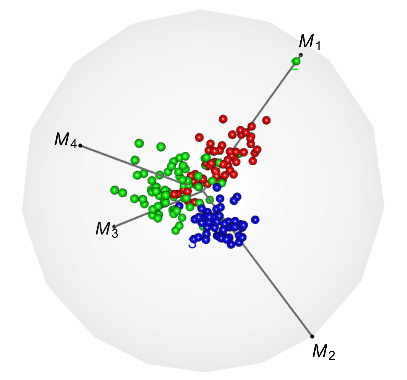

An Introduction to radviz3d for Visualizing High-dimensional Data with Continuous or Dicrete Features
================

<<<<<<< HEAD
The radviz3d package is developed for 3D radial visualization of high-dimensional datasets. Our display engine is called RadViz3D and extends the classic 2D radial visualization and displays multivariate data on the 3D space by mapping every record to a point inside the unit sphere. RadViz3D obtains equi-spaced anchor points exactly for the five Platonic solids and approximately for the other cases via a Fibonacci grid. We also propose a Max-Ratio Projection (MRP) method that utilizes the group information in high dimensions to provide distinctive lower-dimensional projections that are then displayed using Radviz3D. Our methodology is extended to datasets with discrete and mixed features where a generalized distributional transform (GDT) is used in conjuction with copula models before applying MRP and RadViz3D visualization. This document gives a brief introduction to the functions included in with several application examples.
=======
The package is developed for 3D radial visualization of high-dimensional datasets. Our display engine called RadViz3D extends the classic 2D radial visualization and displays multivariate data on the 3D space by mapping every record to a point inside the unit sphere. RadViz3D obtains equi-spaced anchor points exactly for the five Platonic solids and approximately for the other cases via a Fibonacci grid. We also propose a Max-Ratio Projection (MRP) method that utilizes the group information in high dimensions to provide distinctive lower-dimensional projections that are then displayed using Radviz3D. Our methodology is extended to datasets with discrete and mixed features where a generalized distributional transform (GDT) is used in conjuction with copula models before applying MRP and RadViz3D visualization. This document gives a brief introduction to the functions included in with several application examples.
>>>>>>> 61dbcfb9e566f4eaa109a901a49ab7fd7e8a5af9

Functions
---------

radviz3d contains 3 functions:

-   `Gtrans`: Transform discrete or mixture of discrete and continuous datasets to continuous datasets with marginal normal(0,1).
-   `mrp`: Project high-dimensional datasets to lower dimention with max-ratio projection.
-   `radialvis3d`: Visualize appropriately tranformed datasets in the unit sphere.

The main function `radialvis3d` is able to displays and classifies data points from the pre-known groups and provide visual clues to how the grouped data are separately from each other.

Examples
--------

We illustrate the usage of `radialvis3d` on datasets with small (&lt; 10) and large dimensions and with continuous or discrete features. The interactive 3D plot are produced from `rgl` and can be rotated manually to get better perspectives on `rgl`-supported devices.

### Displaying original datasets

For small datasets with continuous values, function `radialvis3d` can be applied directly with options **domrp = F** and **doGtrans = F**. The 3D plot below are displayed for the (Fisher's or Anderson's) iris data. The dataset contains 50 flowers measurements for 4 variables, sepal length, sepal width, petal length and petal width which are represented by the 4 anchor points in the plot. Flowers come from each of 3 species, Iris setosa, Iris versicolor, and Iris virginica. Speicies groups are shown in different colors and tagged with name labels.

``` r
library(radviz3d)
data("iris")
radialvis3d(data = iris[, -5], cl = factor(iris$Species), domrp = F, doGtrans = F, 
            lwd = 2, alpha = 0.05, pradius = 0.025, class.labels = levels(iris$Species))
```


### Display reduced datasets

For large datasets with continuous values, we use function `radialvis3d` with options **doGtrans = F** and **domrp = T** along with the number of principal components *k* specified by **npc = k**. The plot for a wine dataset are shown below. The dataset (reference link: ) contains 178 samples of three types of wines grown in a specific area of Italy. 13 chemical analyses were recorded for each sample.

``` r
radialvis3d(data = wine[, -14], cl = factor(wine[,14]), domrp = T, npc = 4, doGtrans = F, 
            lwd = 2, alpha = 0.05, pradius = 0.025, class.labels = levels(wine[,14]))
#> cumulative variance explained: 0.9913192 1 1 1 1 1 1 1 1 1 1 1 1
```



### Display transformed datasets

Datasets with discrete values can be transformed using options **doGtrans = T**. (Currently, GDT is not applicable to categorical variables). Here we present an example for an Indic scripts dataset (reference link: ) which is on 116 different features from handwritten scripts of 11 Indic languages. A subset of 5 languages is chosen from 4 regions, namely Bangla (from the east), Gurmukhi (north), Gujarati (west), and Kannada and Malayalam (languages from the neighboring southern states of Karnataka and Kerala) and a sixth language (Urdu, with a distinct Persian script). Some of the features contains discrete values so the dataset is essentially of mixed attributes. We apply `radialvis3d` with GDT and MRP (**npc = 6**) to display for distinctiveness of samples from each languages.

``` r
radialvis3d(data = script[,-117], cl = class, domrp = T, npc = 6, doGtrans = T, 
            lwd = 2, alpha = 0.05, pradius = 0.025, class.labels = levels(class))
<<<<<<< HEAD
#> cumulative variance explained: 0.3657176 0.6483712 0.8262958 0.9430634 1 1 1 1 1 1 1 1 1 1 1 1 1 1 1 1 1 1 1 1 1 1 1 1 1 1 1 1 1 1 1 1 1 1 1 1 1 1 1 1 1 1
=======
#> cumulative variance explained: 0.3695687 0.6531619 0.8259521 0.9382708 1 1 1 1 1 1 1 1 1 1 1 1 1 1 1 1 1 1 1 1 1 1 1 1 1 1 1 1 1 1 1 1 1 1 1 1 1 1 1 1 1 1
>>>>>>> 61dbcfb9e566f4eaa109a901a49ab7fd7e8a5af9
```


